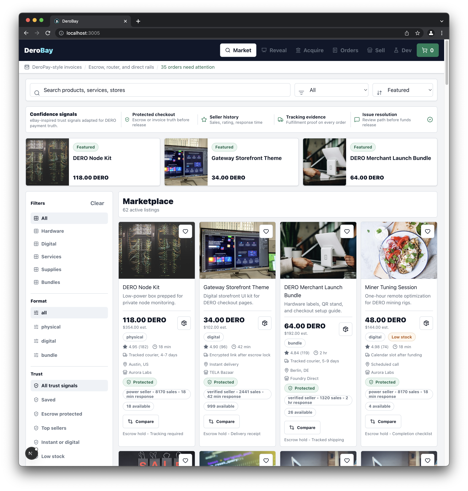
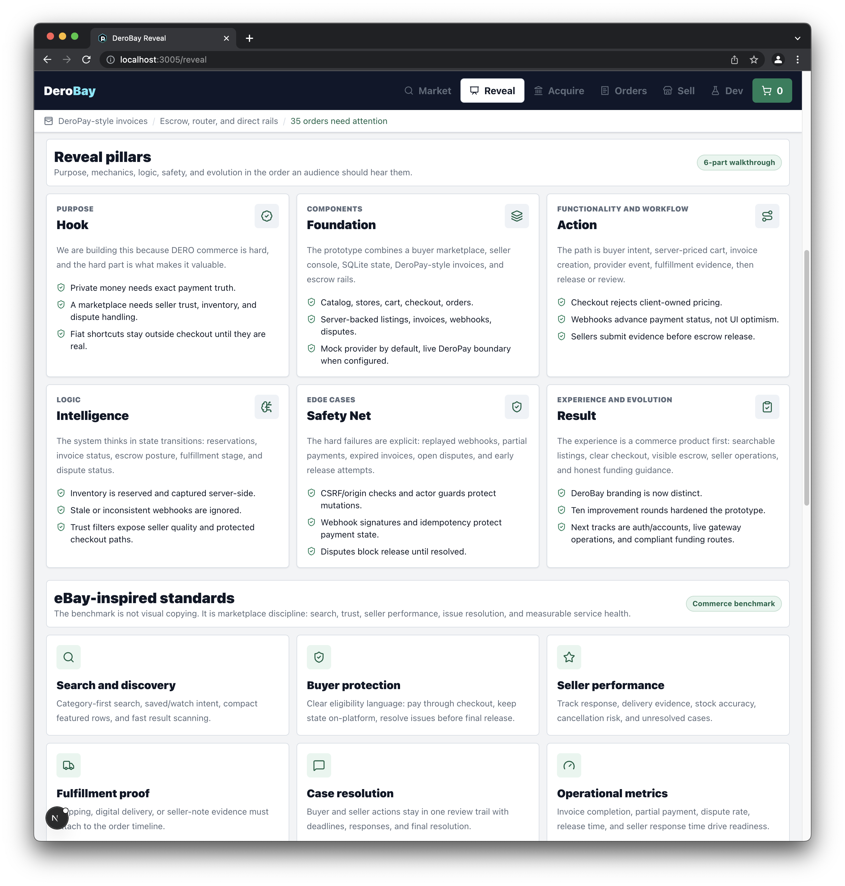

# DERO Marketplace

> A DeroPay starter template — [deropay.com/templates](https://deropay.com/templates)

A product-first DERO marketplace prototype with multi-vendor stores, buyer/seller flows, and DeroPay invoice + escrow checkout. Inspired by Redplaza and classic marketplace patterns from eBay, Amazon, and AliExpress.





## What works

- Buyer marketplace with search, category filters, sort controls, seller stores, product detail pages, cart, checkout, and order tracking.
- Saved listings, recently viewed listings, compare selections, and trust-focused catalog filters.
- Buyer order detail pages with invoice payment instructions, copyable address and URI, escrow milestones, delivery evidence, release, and dispute actions.
- Buyer order help with structured marketplace review reasons and dispute timelines.
- Seller console with server-backed listing creation, inventory state, seller-owned order inbox, fulfillment evidence, dispute response, and policy tabs.
- DeroPay-style checkout with buyer delivery defaults, inventory preflight, direct invoice, payment router, and escrow rails.
- Developer-only `/dev` console for local webhook simulation, invoice polling, raw invoice inspection, and fulfillment state transitions.
- Integrated-address invoice simulation with detected, confirming, completed, partial, expired, webhook, fulfillment, dispute, and release states.
- Server-owned listings, orders, invoices, webhook events, fulfillment evidence, and disputes backed by SQLite.
- Payment provider boundary with mock mode by default and env-ready live DeroPay mode.
- DERO Acquire page kept as a separate funding guide, not a pretend fiat checkout path.
- Round-by-round improvement log in `docs/improvement-rounds.md`.

## Environment

```bash
PAYMENT_PROVIDER=mock
DATABASE_PATH=./data/marketplace.sqlite
DEROPAY_BASE_URL=
DEROPAY_API_KEY=
DEROPAY_WEBHOOK_SECRET=
ENABLE_DEV_TOOLS=true
```

Set `PAYMENT_PROVIDER=deropay` only when a self-hosted DeroPay gateway URL and API key are available. Secrets stay server-side.
`/dev` is enabled outside production by default. In production, set `ENABLE_DEV_TOOLS=true` only for a locked-down staging environment.

## Run

```bash
bun install
bun run dev
```

Open `http://localhost:3005`.

## Verify

```bash
bun run lint
bun run typecheck
bun run test
bun run build
bun run test:e2e
```
